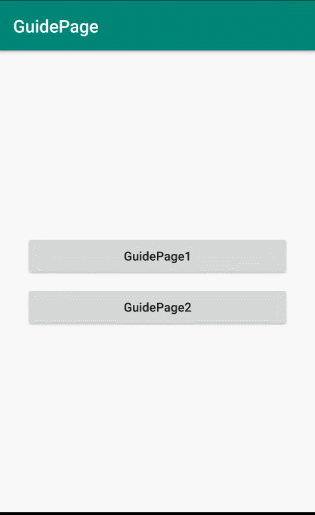

# GuidePage


[](https://raw.githubusercontent.com/jenly1314/GuidePage/master/app/release/app-release.apk)
[](https://bintray.com/beta/#/jenly/maven/guidepage)
[](https://jitpack.io/#jenly1314/GuidePage)
[](https://travis-ci.org/jenly1314/GuidePage)
[](https://circleci.com/gh/jenly1314/GuidePage)
[](https://android-arsenal.com/api?level=16)
[](https://opensource.org/licenses/mit-license.php)
[](https://jenly1314.github.io/)
[](http://shang.qq.com/wpa/qunwpa?idkey=8fcc6a2f88552ea44b1411582c94fd124f7bb3ec227e2a400dbbfaad3dc2f5ad)

GuidePage for Android 是一个App欢迎引导页。一般用于首次打开App时场景，通过引导页指南，概述App特色等相关信息

## Gif 展示



## 引入

### Maven：
```maven
<dependency>
  <groupId>com.king.guide</groupId>
  <artifactId>guidepage</artifactId>
  <version>1.0.0</version>
  <type>pom</type>
</dependency>
```
### Gradle:
```gradle
implementation 'com.king.guide:guidepage:1.0.0'
```

### Lvy:
```lvy
<dependency org='com.king.guide' name='guidepage' rev='1.0.0'>
  <artifact name='$AID' ext='pom'></artifact>
</dependency>
```

###### 如果Gradle出现compile失败的情况，可以在Project的build.gradle里面添加如下：（也可以使用上面的GitPack来complie）
```gradle
allprojects {
    repositories {
        //...
        maven { url 'https://dl.bintray.com/jenly/maven' }
    }
}
```

## 示例

### 代码示例

```Kotlin
    //简单调用示例
    GuidePage.load(intArrayOf(R.drawable.guide_page_1,R.drawable.guide_page_2,R.drawable.guide_page_3,R.drawable.guide_page_4))
            .start(this)//Activity or Fragment
```

```Kotlin
      //Demo中的调用示例
      GuidePage.load(intArrayOf(R.drawable.guide_page_1,R.drawable.guide_page_2,R.drawable.guide_page_3,R.drawable.guide_page_4))
            .pageDoneDrawableResource(R.drawable.btn_done)
//            .indicatorDrawableResource(R.drawable.indicator_radius)
//            .indicatorSize(this,6f)//默认5dp
            .showSkip(v.id == R.id.btn1)//是否显示“跳过”
            .lastPageHideSkip(true)//最后一页是否隐藏“跳过”
            .onGuidePageChangeCallback(object : GuidePage.OnGuidePageChangeCallback{//引导页改变回调接口

                override fun onPageDone(skip: Boolean) {
                    //TODO 当点击完成(立即体验)或者右上角的跳过时，触发此回调方法
                    //这里可以执行您的逻辑，比如跳转到APP首页或者登陆页
                    if(skip){
                        Toast.makeText(this@MainActivity,"跳过",Toast.LENGTH_SHORT).show()
                    }else{
                        Toast.makeText(this@MainActivity,"立即体验",Toast.LENGTH_SHORT).show()
                    }
                }

            })
            .start(this)//Activity or Fragment

```

更多使用详情，请查看[app](app)中的源码使用示例

## 版本记录

#### v1.0.0：2019-12-24
*  GuidePage初始版本

## 赞赏
如果您喜欢GuidePage，或感觉GuidePage帮助到了您，可以点右上角“Star”支持一下，您的支持就是我的动力，谢谢 :smiley:<p>
您也可以扫描下面的二维码，请作者喝杯咖啡 :coffee:
    <div>
        
        
        
        
    </div>

## 关于我
   Name: <a title="关于作者" href="https://about.me/jenly1314" target="_blank">Jenly</a>

   Email: <a title="欢迎邮件与我交流" href="mailto:jenly1314@gmail.com" target="_blank">jenly1314#gmail.com</a> / <a title="给我发邮件" href="mailto:jenly1314@vip.qq.com" target="_blank">jenly1314#vip.qq.com</a>

   CSDN: <a title="CSDN博客" href="http://blog.csdn.net/jenly121" target="_blank">jenly121</a>

   博客园: <a title="博客园" href="https://www.cnblogs.com/jenly" target="_blank">jenly</a>

   Github: <a title="Github开源项目" href="https://github.com/jenly1314" target="_blank">jenly1314</a>

   加入QQ群: <a title="点击加入QQ群" href="http://shang.qq.com/wpa/qunwpa?idkey=8fcc6a2f88552ea44b1411582c94fd124f7bb3ec227e2a400dbbfaad3dc2f5ad" target="_blank">20867961</a>
   <div>
       
       
   </div>
